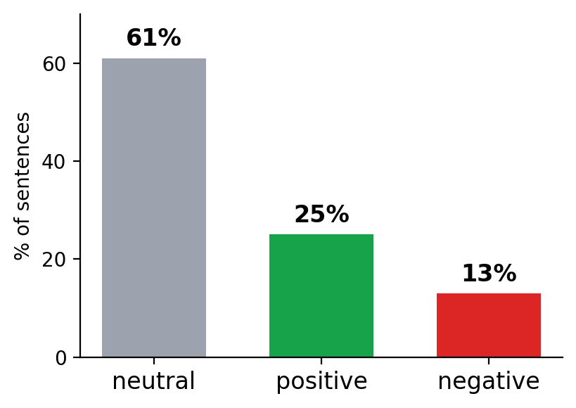
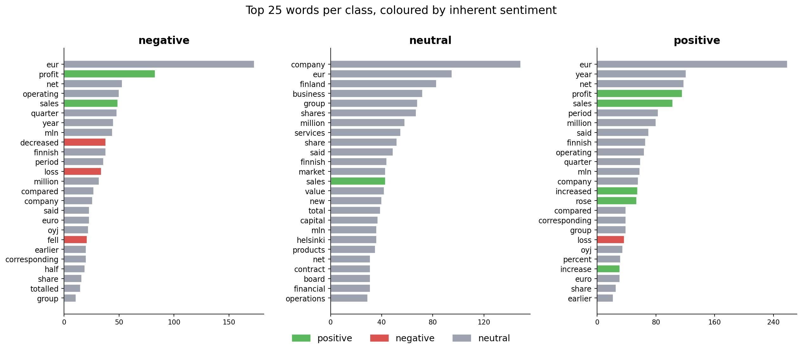
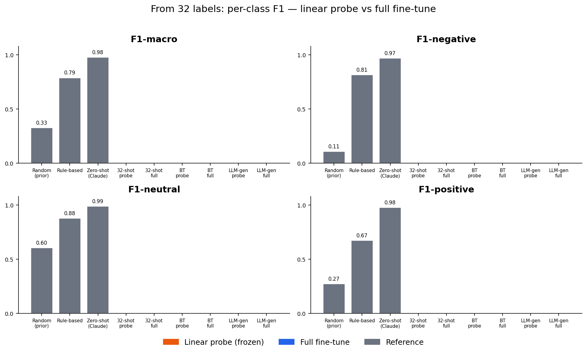
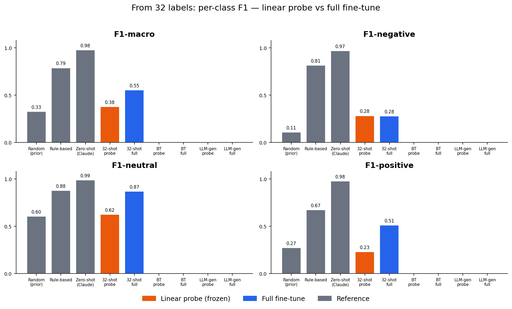
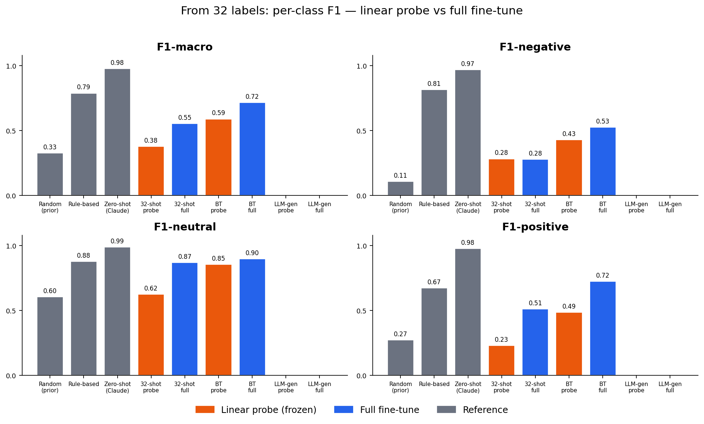
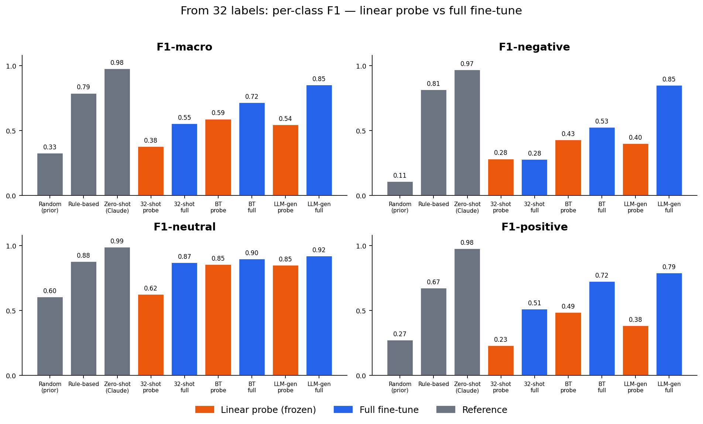
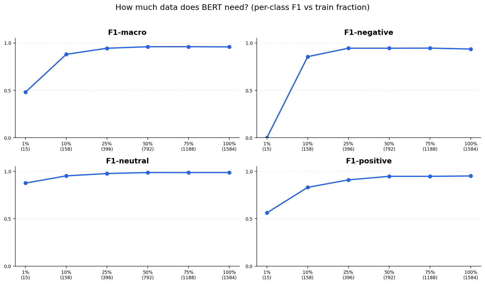
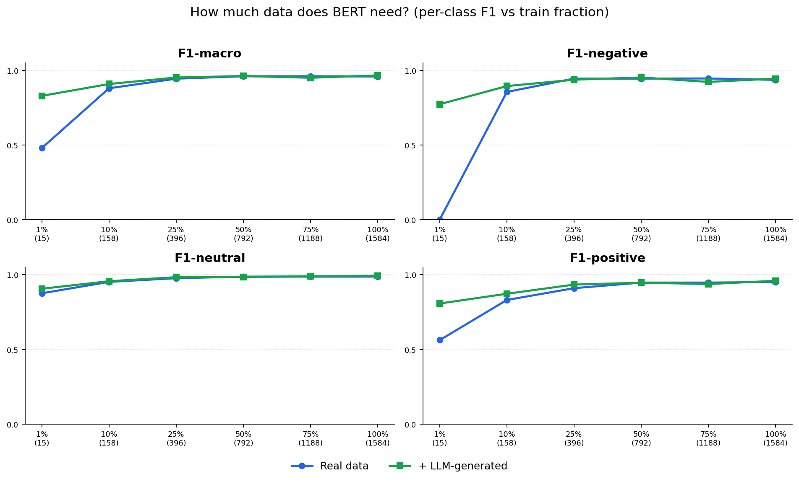
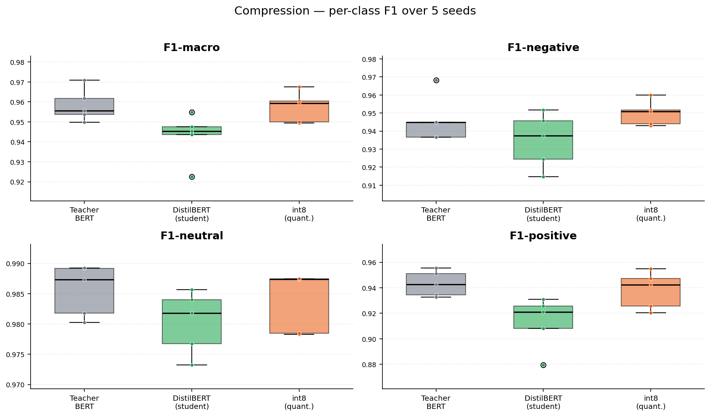

## The task {.smaller}

Sentence-level **financial sentiment** — classify a news sentence as
**negative / neutral / positive**.

- **Dataset:** Financial PhraseBank (`takala/financial_phrasebank`) — ~2,300 sentences, `allagree` config (unanimous annotators).
- **Business case:** signal extraction — an analyst desk or trading system flags negative/positive headlines automatically.
- **Annotation guideline:** labels reflect the *viewpoint of an investor* — each sentence is judged by its likely impact on the **future stock price**

| Class | Example sentence |
|---|---|
| negative | "Operating profit *fell* to EUR 35.4 mn from EUR 68.8 mn." |
| neutral  | "The company has its head office in Helsinki." |
| positive | "Operating profit *rose* to EUR 14.5 mn from EUR 10.2 mn." |

---

## Why the data is tricky {.smaller}

::: {.columns}
::: {.column width="50%"}
**1. Imbalanced**

{width="92%" fig-alt="Class distribution: 61% neutral, 25% positive, 13% negative"}

:::
::: {.column width="50%"}
**2. Contextual, not lexical**

- The data contains **financial words with inherent polarity**, and that **polarity can switch depending on the directional word** it is used with.

[financial word]{style="color:#2563eb;font-weight:600"} · [directional word]{style="color:#ea580c;font-weight:600"}

- **positive** — net [sales]{style="color:#2563eb;font-weight:600"} [increased]{style="color:#ea580c;font-weight:600"} by 5.2% to EUR 205.5 mn, and operating [profit]{style="color:#2563eb;font-weight:600"} by 34.9% to EUR 23.5 mn.
- **negative** — the growth [margin]{style="color:#2563eb;font-weight:600"} [slowed down]{style="color:#ea580c;font-weight:600"} due to the financial crisis.
- **neutral** — Tiimari … generated a [turnover]{style="color:#2563eb;font-weight:600"} of 76.5 mln eur in 2005. 

:::
:::

---

## Data preparation & augmentation {.smaller}

::: {.columns}
::: {.column width="45%"}
**Split & few-shot set**

- **70 / 10 / 20** train / val / test, **stratified by sentiment**
- **Balanced 32-label set** sampled from *train*

**Two augmentations from the 32**

- **Back-translation (no LLM)** — MarianMT through **7 pivot languages** (es, de, ru, fi, tl, ar, zh)
- **LLM-generated** — Groq `llama-3.3-70b`, **temp 0.95** for variety with 3 same-class anchors per call
  - **Prompt** — mimic FPB single-sentence news; label from the **investor's POV**; vary sentiment *strength*; **fictional-but-realistic** company names.
:::
::: {.column width="5%"}
:::
::: {.column width="50%"}
**Did the augmentation meet our criteria?**

| Criterion | Back-translation | LLM |
|---|:--:|:--:|
| New sentences | 197 | **360** |
| Sentiment preserved | ✅ | ✅ |
| Numbers preserved | ✅ guard | ✅ prompt |
| Lexical diversity (new words) | ~200 | **~1000** |
| Structural variety (distinct-3) | 0.57 | **0.83** |

*distinct-3 = unique trigrams ÷ total trigrams (1 = all distinct, 0 = all repeated).*

:::
:::

---

## Benchmarks: floor and ceiling {.smaller}

| Benchmark | macro-F1 | F1-negative | F1-neutral | F1-positive |
|---|:--:|:--:|:--:|:--:|
| Always neutral | 0.253 | 0.000 | 0.761 | 0.000 |
| Prior-weighted random | 0.328 | 0.108 | 0.604 | 0.273 |
| **FinBERT**^[Araci (2019), *FinBERT: Financial Sentiment Analysis with Pre-trained Language Models*, arXiv:1908.10063 — BERT further-pretrained on a financial corpus, then fine-tuned on Financial PhraseBank. Macro-F1 reported on the 100%-agreement subset.] | **0.95** | — | — | — |

---

## A directional rule already goes a long way {.smaller}

{width="98%" fig-align="center"}

::: {style="font-size:0.9em"}
- The **directional words** already separate the classes while inherently-polar financial words show up across **all three**, thus a **rule-based lexicon**.
:::

---

## Benchmarks: the rule-based lexicon slots in {.smaller}

| Benchmark | macro-F1 | F1-negative | F1-neutral | F1-positive |
|---|:--:|:--:|:--:|:--:|
| Always neutral | 0.253 | 0.000 | 0.761 | 0.000 |
| Prior-weighted random | 0.328 | 0.108 | 0.604 | 0.273 |
| **Rule-based lexicon** | **0.788** | **0.815** | **0.876** | 0.674 |
| FinBERT^[Araci (2019), arXiv:1908.10063 — BERT pretrained on a financial corpus, fine-tuned on FPB; macro-F1 on the 100%-agreement subset.] | 0.95 | — | — | — |

---

## Where the rule misses {.smaller}

The misses are the cases direction alone can't reach — they need a **language model**. ([financial word]{style="color:#2563eb;font-weight:600"} · [directional word]{style="color:#ea580c;font-weight:600"})

::: {style="font-size:0.82em"}
[**TRUE negative**]{style="color:#d9534f;font-weight:700"} → [**PRED neutral**]{style="color:#9ca3af;font-weight:700"} ✗ — **direction implied, not stated**

> Operating [loss]{style="color:#2563eb;font-weight:600"} totalled EUR 12.7 mn, compared to a [profit]{style="color:#2563eb;font-weight:600"} of EUR 17.7 mn in the first half of 2008.

[**TRUE neutral**]{style="color:#9ca3af;font-weight:700"} → [**PRED positive**]{style="color:#5cb85c;font-weight:700"} ✗ — **direction unrelated to the financial word**

> These developments partly reflect the government's [higher]{style="color:#ea580c;font-weight:600"} activity in the field of [dividend]{style="color:#2563eb;font-weight:600"} policy.

[**TRUE positive**]{style="color:#5cb85c;font-weight:700"} → [**PRED neutral**]{style="color:#9ca3af;font-weight:700"} ✗ — **no direction at all**

> KONE … received a major [order]{style="color:#2563eb;font-weight:600"} to supply all elevators and escalators for the Watermark Place project in London.
:::

---

## Training with limited data {.smaller}

We start from three references: a random floor, the rule-based lexicon, and the zero-shot LLM ceiling.

{width="86%" fig-align="center"}

---

## Training with limited data {.smaller}

**32 labels** — [linear probe]{style="color:#ea580c;font-weight:700"} (head only) barely beats random; [full fine-tune]{style="color:#2563eb;font-weight:700"} helps but still **loses to the rule-based lexicon**.

{width="86%" fig-align="center"}

---

## Training with limited data {.smaller}

**Back-translation (229)** — paraphrases lift both, and [full fine-tune]{style="color:#2563eb;font-weight:700"} (0.72) now edges past the lexicon.

{width="86%" fig-align="center"}

---

## Training with limited data {.smaller}

**LLM-generated (229)** — [full fine-tune]{style="color:#2563eb;font-weight:700"} jumps to **0.85** and nearing the zero-shot ceiling.

{width="86%" fig-align="center"}

::: {style="font-size:0.7em"}
[Full fine-tune]{style="color:#2563eb;font-weight:700"} beats the [linear probe]{style="color:#ea580c;font-weight:700"} everywhere — adapt the body, not the head. **Information, not model size, was the bottleneck** — and the gains land hardest on the rare **positive / negative** classes.
:::

---

## How much data does BERT need? {.smaller}

Full fine-tune on **1 / 10 / 25 / 50 / 75 / 100 %** of the training data.

{width="84%" fig-align="center"}

::: {style="font-size:0.72em"}
**Steep climb, then plateau** — collapses only at 1% (F1-negative = 0), most gains by ~25%.
:::

---

## How much data does BERT need? {.smaller}

Add the **360 LLM-generated** sentences to each fraction (Part 3c).

{width="84%" fig-align="center"}

::: {style="font-size:0.72em"}
[**+ LLM-generated**]{style="color:#16a34a;font-weight:700"} **rescues the low-data regime** — at 1% it lifts macro 0.48 → 0.83; the gap closes as real data grows.
:::

---

## Closing the gap {.smaller}

| Model | macro-F1 | F1-negative | F1-neutral | F1-positive |
|---|:--:|:--:|:--:|:--:|
| Rule-based lexicon | 0.788 | 0.815 | 0.876 | 0.674 |
| All-LLM BERT (32 + LLM-gen, n=392) | 0.874 | 0.855 | 0.946 | 0.822 |
| FinBERT (Araci 2019) | 0.95 | — | — | — |
| **Full data + LLM-gen (n=1944)** | **0.965** | **0.944** | **0.993** | **0.960** |

---

## What we still miss {.smaller}

Even at 0.965, BERT still trips where **meaning beats the surface word**. ([financial word]{style="color:#2563eb;font-weight:600"} · [directional word]{style="color:#ea580c;font-weight:600"})

::: {style="font-size:0.82em"}
[**TRUE negative**]{style="color:#d9534f;font-weight:700"} → [**PRED positive**]{style="color:#5cb85c;font-weight:700"} ✗ — **direction reverses the surface word**

> …grappling with [higher]{style="color:#ea580c;font-weight:600"} oil and gas prices, which have [pushed up]{style="color:#ea580c;font-weight:600"} the [cost]{style="color:#2563eb;font-weight:600"} of energy, raw materials and transportation.

[**TRUE positive**]{style="color:#5cb85c;font-weight:700"} → [**PRED negative**]{style="color:#d9534f;font-weight:700"} ✗ — **no directional word, anchored on the polar term**

> Pre-tax [loss]{style="color:#2563eb;font-weight:600"} totaled EUR 0.3 mn, compared to a [loss]{style="color:#2563eb;font-weight:600"} of EUR 2.2 mn in the first quarter of 2005.
:::

---

## Shipping it cheaply {.smaller}

Our best BERT is accurate but **heavy**: ~110M params, **438 MB**, ~20 ms/sentence. For deployment we want it **smaller / faster without losing F1**.

We explore two compression methods:

- [**Distillation**]{style="color:#16a34a;font-weight:700"} — a small **student** (DistilBERT, 6 layers) is trained to mimic our full BERT, the **teacher**. Lever for **speed**.
- [**Quantization**]{style="color:#ea580c;font-weight:700"} — store weights in **int8** instead of fp32 (dynamic, post-training). Lever for **memory**.

> Question: how much accuracy do we give up — and on which classes?

---

## Compression keeps the accuracy {.smaller}

{width="80%" fig-align="center"}

::: {style="font-size:0.72em"}
[**int8**]{style="color:#ea580c;font-weight:700"} tracks the teacher (**99.9%** of macro-F1 retained); the [**DistilBERT student**]{style="color:#16a34a;font-weight:700"} costs ~1.5 macro points, almost all of it on the rare **positive** class. 5 seeds → the spread is real, not a single lucky run.
:::

---

## Size vs speed vs accuracy {.smaller}

| | Teacher BERT (fp32) | [DistilBERT (student)]{style="color:#16a34a;font-weight:700"} | [int8 (dynamic)]{style="color:#ea580c;font-weight:700"} |
|---|:--:|:--:|:--:|
| macro-F1 (5-seed mean) | 0.958 | 0.943 | 0.957 |
| macro-F1 retained | 100% | 98.4% | **99.9%** |
| Parameters | 109.5M | 67.0M | **23.9M** |
| Size on disk | 438 MB | 268 MB (1.6× smaller) | **181 MB (2.4× smaller)** |
| Latency / sentence | 20.3 ms | **12.0 ms (1.7× faster)** | 110 ms (*slower*) |

- **Distillation buys speed** — 1.7× faster, ~½ the params, ~1.5 F1 cost.
- **Quantization buys memory, not latency** — 2.4× smaller, but int8 has **no kernel acceleration on this CPU**, so it runs *slower*.

---

## Where the student loses — and how to close it {.smaller}

::: {.columns}
::: {.column width="48%"}
**The deficiency**

- [DistilBERT]{style="color:#16a34a;font-weight:700"} loses **0.016 macro-F1** — small but real.
- Almost all of it on the **positive** class (0.94 → 0.91); 6 layers blur the **positive ↔ neutral** boundary first.
- Cause: **logit-only** distillation on the **same 792 examples** — no feature transfer, no extra data.
:::
::: {.column width="4%"}
:::
::: {.column width="48%"}
**How to close it**

- **Feature-based KD** (TinyBERT / PKD) — transfer hidden states, not just logits.
- **More transfer data** — teacher soft-labels the LLM-generated / unlabelled text.
- **Protect positive** — sweep `T`/`alpha`, oversample the class.
- **Stack levers** — distil → int8; QLoRA for memory.
:::
:::

---

## Thank you {.center}

### Questions?

**Xianrui Cao · Cherryl Chico · Xiaoyan Wang · Elvis Casco**

*22DM015 — Advanced Methods in NLP · Financial PhraseBank · BERT track*

---

## Backup — full scoreboard {.smaller visibility="uncounted"}

| Model | Labels | macro-F1 | Notes |
|---|:--:|:--:|---|
| Random | — | 0.328 | floor |
| Majority neutral | — | 0.25 (acc 0.61) | no skill |
| Rule-based lexicon | 0 | 0.788 | strong neg, weak pos |
| Frozen BERT probe | 32 | 0.379 | ≈ random |
| BERT fine-tuned | 32 | 0.554 | loses to rules |
| Back-translation → BERT | 229 | 0.716 | no new info |
| LLM-generated → BERT | 392 | 0.874 | best Part-2 |
| BERT (full data) | 1584 | 0.958 | within ~2 pts of LLM |
| BERT + LLM-gen (full) | 1944 | 0.965 | best local |
| LLM zero-shot (Claude) | 0 | 0.978 | contamination caveat |

---

## Backup — per-class diagnostics {.smaller visibility="uncounted"}

**Rule-based baseline — where it fails**

- NEGATIVE F1 **0.815** (strong) · NEUTRAL strong · POSITIVE F1 **0.674** (weak)
- Failure mode: positives leak into neutral (financial positivity is phrased indirectly).

**Low-data BERT — opposite failure**

- Collapses toward the **majority (neutral)** class at small fractions.

> Per-class F1 is the single best diagnostic in the project — it shows *which* class each model misses, which a single macro number hides.
